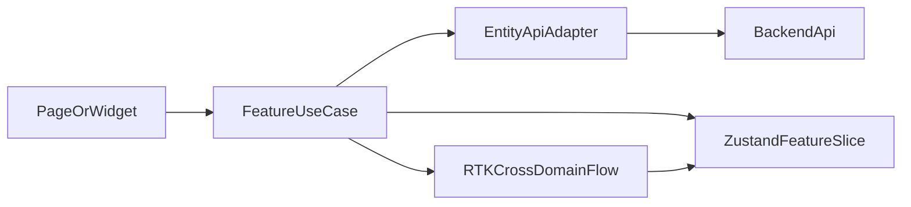

# State Flow: Hybrid Zustand + RTK

## Цели

- Изолировать feature-состояние и UI-state в локальных slice.
- Вынести сложные cross-domain потоки в единый orchestrator.
- Исключить циклические зависимости и дубли загрузок.

## Границы слоев

- `entities/*`
  - типы сущностей, нормализация, entity-level API adapters.
- `features/*/model`
  - use-cases и orchestrators (submit, approve, assign).
- `stores/*` (Zustand)
  - локальные и bounded-context state slice.
- `app/state` (RTK)
  - cross-domain сценарии и shared cache для зависимых доменов.

## Поток данных

## Правила

1. Page-компоненты не вызывают `apiClient` напрямую.
2. UI-компоненты не содержат бизнес-правил.
3. Данные с повторным использованием между доменами идут через RTK flow.
4. Локальные формы и фильтры остаются в Zustand slice.

