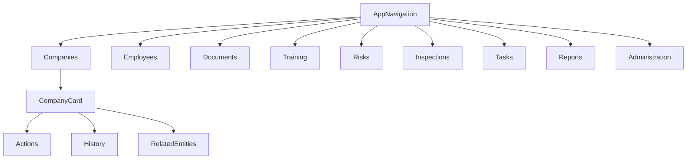

# Target Navigation Map

## Доменная структура

- Компании
- Сотрудники
- Документы
- Обучение
- Риски
- Проверки
- Задачи
- Отчеты
- Администрирование

## Принцип вложенности

`Объект -> Действия -> История -> Связанные сущности`

### Пример: Company

- Карточка компании
- Действия: создать документ, задачу, риск, проверку
- История: документы, активности, события
- Связанные сущности: сотрудники, риски, проверки

## Логика группировки

1. Пользователь входит в домен через сущность, а не через технический процесс.
2. Глобальные разделы остаются для мониторинга, но action-first сценарии доступны в контексте сущности.
3. Термины меню отражают бизнес-значение, а не внутреннюю реализацию.
4. Разделы с одинаковой природой действий объединяются (например, проверки и предписания).

## Навигационный каркас

