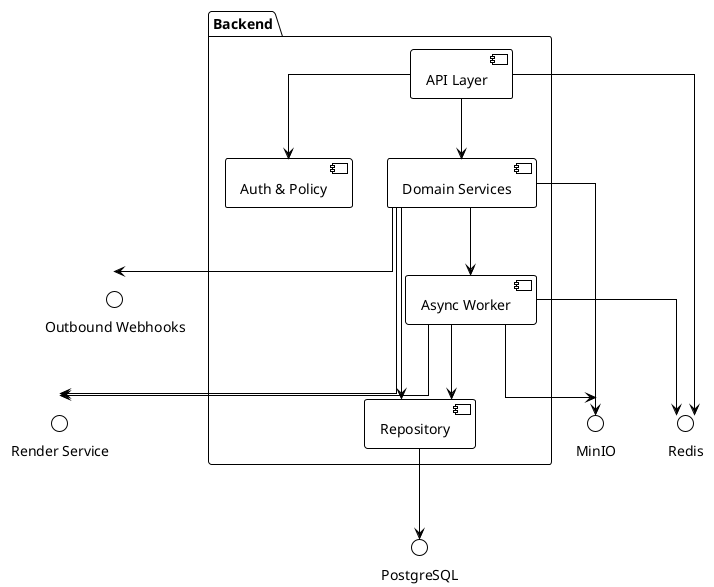

# Backend_TZ.md
Версия: v2.0 • Дата: 2025-10-15 • Часовой пояс: Europe/Moscow

## 0) Резюме
- **Цель backend.** Собрать единый API, который ведёт учёт компаний, людей, рисков и документов, а ещё строит отчёты и работает с шаблонами.
- **Ограничения.** Мультиарендность обязательна. Нельзя ломать уже опубликованные REST-пути без переходного периода. Вся генерация больших файлов только в фоне. Сервис обязан жить в Docker.
- **Допущения.** *Предполагаем, что фронтенд говорит только по REST и умеет работать с JWT.* *Предполагаем, что внешние системы (1С, ФРДО, ЕИСОТ) принимают наши webhooks c повтором.*
- **Диаграмма контекста (C4 System/Container, текст).**
  - Пользователь → Браузер → Backend API.
  - Backend API общается с PostgreSQL, Redis, MinIO, сервисом рендеринга документов и сервисами интеграций.
  - Очереди держатся в Redis. Celery worker забирает задачи генерации.
  - Webhooks дергают 1С, ФРДО, ЕИСОТ. SSO/OAuth поставляет токены.
```
+ Пользователи / интеграции
  -> Frontend (SPA, мобилки)
     -> Backend API (FastAPI)
        -> PostgreSQL (данные)
        -> Redis (кэш + очередь)
        -> MinIO/S3 (файлы)
        -> Render-сервис (LibreOffice/Pandoc)
        -> Очередь событий (Outbox → Webhooks 1С/ФРДО/ЕИСОТ)
        -> Auth IdP (OIDC)
```

## 1) Архитектура
- **Выбор архитектуры.** Берём модульный монолит на FastAPI. Почему так: единая транзакция для сложных сценариев, меньше накладных расходов на DevOps, проще миграции между схемами. Отдельно выделяем Celery worker для тяжёлых задач.
- **Компоненты.**
  - API слой (`backend/app/api`): маршруты v1, валидация, маппинг ролей.
  - Службы домена (`backend/app/services` и `backend/app/domains/*`): бизнес-правила.
  - Слой данных (`backend/app/models`, `backend/app/repository`): SQLAlchemy 2.0 ORM.
  - Фоновые задачи (`backend/app/tasks.py`, `worker/`): генерация пакетов, уведомления, интеграции.
  - Интеграции (`backend/app/services/integrations`): клиенты 1С/ФРДО/ЕИСОТ, webhooks.
- **Диаграмма компонентов (PlantUML).**

- **Потоки данных.** Входящий REST → валидация Pydantic → проверка прав → транзакция в PostgreSQL → запись outbox-событий → постановка задач Celery → ожидание воркера → отдача ссылки на файл. Массовые выборки кэшируем в Redis (TTL 5 минут, слоёный ключ `tenant:entity:filters`).
- **Асинхронность.** Celery + Redis. Очереди: `documents`, `reports`, `integrations`. Beat-планировщик поднимаем в worker для напоминаний и ретраев webhooks. Отложенные задачи — через Celery ETA. Почему так: уже есть Celery в репозитории, reuse.
- **Масштабирование.** API и worker stateless. Масштабируем по контейнерам. PostgreSQL — Primary + Read Replica. MinIO — распределённый кластер. Redis в режиме Sentinel. Липкие сессии не нужны. Stateful только PostgreSQL и MinIO. Все сервисы читают конфиг из `.env` через Pydantic Settings.

## 2) Хранение данных
- **СУБД.** PostgreSQL 15 + asyncpg. Почему так: нужен JSONB, индексы, транзакции, row-level security по tenant, полнотекстовый поиск по документам.
- **Дополнительные хранилища.** Redis 7 (кэш + Celery backend). MinIO/S3 (файлы). Timescale-расширение не требуется.
- **ERD.** См. `erd.puml` в корне. Диаграмма покрывает ядро, документы, проверки, СИЗ, риски, LMS.
- **Словарь данных.** Короткие названия, UUID v7.
  - `tenant(id, slug*, name, contact_email, settings_json, created_at, updated_at)`.
  - `feature(id, code*, title, description)`.
  - `tenant_feature(id, tenant_id FK→tenant, feature_id FK→feature, enabled, config_json)`.
  - `policy_rule(id, tenant_id, subject_type, subject_id, action, resource, condition_json)` — хранит расширенные политики.
  - `user_account(id, tenant_id, email*, full_name, role, hashed_password, is_active, last_login_at, mfa_secret, created_at)`.
  - `company(id, tenant_id, name*, inn, kpp, ogrn, legal_address, actual_address, director, bank_name, bank_bik, bank_account, phone_numbers, email, logo_file_id, stamp_file_id, work_types, hazardous_factors)`.
  - `site(id, tenant_id, company_id, name, address, geo_json, hazard_class)`.
  - `position(id, tenant_id, company_id, name, description)`.
  - `person(id, tenant_id, company_id, position_id, first_name, last_name, middle_name, birth_date, snils, email, phone, employment_status, personnel_number, hired_at, qualifications_json, passport, current_ppe)`.
  - `employment_record(id, tenant_id, person_id, start_date, end_date, contract_no, note)`.
  - `training_program(id, tenant_id, code*, title, hours, regulatory_basis)`.
  - `training_assignment(id, tenant_id, person_id, program_id, status, assigned_at, due_at, completed_at, certificate_no, frdo_payload_json)`.
  - `medical_exam(id, tenant_id, person_id, exam_type, exam_date, conclusion, valid_until, file_id)`.
  - `permit(id, tenant_id, person_id, permit_type, issued_at, valid_until, status, file_id)`.
  - `ppe_norm(id, tenant_id, position_id, item_code, item_name, quantity, interval_days)`.
  - `ppe_stock(id, tenant_id, location, item_code, item_name, size, quantity_on_hand)`.
  - `ppe_issue(id, tenant_id, person_id, item_code, issued_at, due_at, returned_at, status, stock_id)`.
  - `template(id, tenant_id, code*, title, category, description, default_context_json)`.
  - `template_version(id, tenant_id, template_id, version_no, status, checksum, storage_key, schema_json, published_at)`.
  - `document_pack(id, tenant_id, code*, title, description, module, is_active)`.
  - `document_pack_item(id, tenant_id, pack_id, template_version_id, order_no, required, condition_json)`.
  - `document_job(id, tenant_id, pack_id, requested_by, status, payload_json, idempotency_key, queued_at, started_at, finished_at)`.
  - `document(id, tenant_id, job_id, template_version_id, company_id, site_id, person_id, status, file_id, signed_file_id, hash, created_at)`.
  - `document_version(id, tenant_id, document_id, version_no, status, data_json, file_id, created_at)`.
  - `checklist(id, tenant_id, code*, title, scope, version_no, source_npa, is_active)`.
  - `checklist_item(id, tenant_id, checklist_id, order_no, text, severity, required, hint)`.
  - `inspection(id, tenant_id, checklist_id, company_id, site_id, inspector_id, status, started_at, finished_at, result_json)`.
  - `inspection_item_result(id, tenant_id, inspection_id, checklist_item_id, answer, comment, photo_file_id)`.
  - `violation(id, tenant_id, inspection_id, npa_ref, severity, description, deadline, status)`.
  - `corrective_action(id, tenant_id, violation_id, action_text, responsible_person_id, due_date, completed_at, status)`.
  - `incident(id, tenant_id, company_id, site_id, reporter_id, occurred_at, severity, description, status, root_cause, file_id)`.
  - `incident_action(id, tenant_id, incident_id, action_text, assignee_id, due_date, completed_at, status)`.
  - `risk_register(id, tenant_id, company_id, site_id, methodology_id, revision_no, approved_at)`.
  - `risk_entry(id, tenant_id, register_id, hazard, probability, consequence, risk_level, controls_json, residual_level)`.
  - `risk_methodology(id, tenant_id, name*, matrix_json, scoring_json)`.
  - `npa(id, tenant_id, code*, title, edition_date, status)`.
  - `npa_binding(id, tenant_id, npa_id, entity_type, entity_id, context_json)`.
  - `file_asset(id, tenant_id, storage_key, bucket, size_bytes, mime_type, sha256, uploaded_at, metadata_json)`.
  - `audit_log(id, tenant_id, when, user_id, action, object_type, object_id, ip, details_json, created_at)`.
  - `outbox_event(id, tenant_id, topic, payload_json, status, attempts, last_error, scheduled_at, processed_at)`.
  - `webhook_subscription(id, tenant_id, target, secret, event_types_json, is_active, retry_policy_json)`.
- **Индексы и ограничения.** Все `code` и `slug` — уникальны внутри tenant. Создаём составные индексы `(tenant_id, status)`, `(tenant_id, company_id)` для списков. JSON поля индексируем через `GIN` там, где фильтруем.
- **Политика миграций.** Alembic, префикс `VYYYYMMDDHHMM_description`. Обязателен `downgrade`. Фикстуры — каталоги НПА, дефолтные фичи, один тестовый tenant. Seed запускаем командой `make seed` (добавим скрипт).
- **Архив и retention.** Файлы: версии в MinIO, WORM-бакет 5 лет, архив в Glacier-совместимое хранилище по Cron. Записи `document_version` не удаляем, только soft-delete через `status=archived`. Audit и outbox чистим по rolling window 24 месяца (через Celery beat).

## 3) Бизнес-логика и инварианты
- **Общие правила.**
  - В каждой таблице есть `tenant_id`, `created_at`, `updated_at`, `version` (оптимистическая блокировка).
  - Любое действие записывает audit_log + outbox событие.
  - Статусы документов: `draft → review → signed → archived`. Переход назад запрещён, кроме `review → draft`.
- **Компания.** Нельзя удалить, если есть активные люди или договоры. При изменении названия обновляем связанные документы через новую версию (idempotency key по комбинации).
- **Персонал.** Нельзя создать `person`, если нет компании и позиции. При деактивации человека закрываем активные назначения и выдачи СИЗ.
- **Обучение.** `training_assignment` требует актуальный `training_program`. Завершение возможно только если есть сертификат + запись в ФРДО (webhook подтверждает).
- **Медосмотры и допуски.** Перед выдачей допуска проверяем, что медосмотр ещё валиден. Инвариант: `permit.valid_until >= today` для статуса `active`.
- **СИЗ.** `ppe_issue` может быть создан только если есть доступный остаток в `ppe_stock`. Остаток уменьшаем транзакционно. Возврат увеличивает склад.
- **Шаблоны.** Новая версия `template_version` становится активной только после явной публикации. Нельзя удалить версию, если на ней висят документы.
- **Документы.** `document_job` агрегирует генерацию pack. Пока job `running`, API не позволяет повторно запускать тот же idempotency-key. Каждая генерация делает `document_version`.
- **Проверки.** Инспекция создаётся из шаблона чек-листа. Результаты вопросов не редактируем после завершения. Нарушения должны ссылаться на пункт НПА.
- **Инциденты.** Закрыть инцидент можно только если все `incident_action` завершены.
- **Риски.** `risk_entry.risk_level` вычисляется сервисом на основе методологии. Ручное редактирование уровня запрещено, только пересчёт.
- **Сценарии.**
  - *«Выход на объект»*: (1) Пользователь выбирает объект → (2) сервис проверяет `training_assignment`, `medical_exam`, `permit`, `ppe_issue` → (3) если ошибка, формируем список нарушений → (4) создаём `document_job` по pack `OT_ENTER_SITE` → (5) Celery рендерит шаблоны → (6) API отдаёт ссылки.
  - *«Несчастный случай»*: (1) Создаём `incident` + файлы → (2) назначаем действия → (3) собираем pack `ACCIDENT_INVESTIGATION` → (4) уведомляем ответственных → (5) следим за корректирующими действиями.
  - *«Проверка»*: (1) Назначаем инспекцию → (2) мобайл-клиент заполняет результаты → (3) фиксируем нарушения с фото → (4) формируем акты и предписания → (5) запускаем отслеживание `corrective_action`.

## 4) API контракт
- Полный контракт лежит в `openapi.yaml` (OpenAPI 3.1). В него входят все сущности, ошибки, схемы и примеры.
- **Стандарт запросов.**
  - Пагинация: `?limit=…&offset=…`, максимум 200. Ответ содержит `items` и `total`.
  - Сортировка: `?sort=field:asc,other:desc`.
  - Фильтры: `?filter[field]=value` (поддерживает массивы и диапазоны `value.from`/`value.to`).
  - Идемпотентность: заголовок `Idempotency-Key` для POST, срок хранения ключей 48 часов.
- **Ошибки.** JSON `{ "code": "string", "message": "string", "details": {…}, "trace_id": "uuid" }`. 422 — валидация, 403 — политика, 409 — конфликт идемпотентности.
- **Критичные CURL.**
```bash
# Вход
curl -X POST https://api.example.com/api/v1/auth/login \
  -H 'Content-Type: application/json' \
  -d '{"email":"user@demo.ru","password":"secret","tenant":"demo"}'

# Генерация пакета
curl -X POST https://api.example.com/api/v1/document-jobs \
  -H 'Authorization: Bearer <token>' \
  -H 'Idempotency-Key: 123e4567-e89b-12d3-a456-426614174000' \
  -H 'Content-Type: application/json' \
  -d '{"pack_code":"OT_ENTER_SITE","company_id":"...","site_id":"...","person_ids":["..."]}'

# Фиксация инцидента
curl -X POST https://api.example.com/api/v1/incidents \
  -H 'Authorization: Bearer <token>' \
  -H 'Content-Type: application/json' \
  -d '{"company_id":"...","site_id":"...","occurred_at":"2025-10-10T08:00:00Z","severity":"high","description":"..."}'
```
- **Документация.** Swagger и ReDoc собираем из `openapi.yaml`. Schemathesis тестирует контракт.

## 5) Безопасность и доступ
- **Аутентификация.** OAuth2/OIDC с паролем и refresh. Access JWT (15 минут), refresh JWT (24 часа). Почему так: легко интегрировать фронт, совместимо с уже реализованным кодом.
- **Авторизация.** RBAC по ролям (`owner, admin, ot_specialist, pb_specialist, ...`) + ABAC: проверяем tenant, company, feature. Политики Casbin-style в `policy_rule`. Проверка на уровне маршрута и на уровне репозитория (scoped query).
- **Валидация.** Pydantic v2, схемы для каждого тела. Ограничение размера JSON 1 МБ, multipart 25 МБ. Для файлов — MIME белый список и ClamAV проверка (asynchronous).
- **Rate limiting.** Nginx/Envoy: 200 rps на токен, 20 rps на IP без токена. Персистим счётчики в Redis.
- **Секреты.** Держим в `.env` и Secret Manager. Ключи JWT ротуем каждые 30 дней, kid в хедере. Минорные секреты (webhook) шифруем в базе (KMS, AES-GCM).
- **Аудит.** Любое изменение критичных сущностей → audit_log + trace_id из заголовка `X-Request-ID`.

## 6) Обработка файлов и шаблонов
- **Хранилище.** MinIO/S3, бакет `prt-docs`. Путь: `{tenant_slug}/{yyyy}/{mm}/{uuid}.{ext}`.
- **Размеры.** Макс загрузка 25 МБ. Документы DOCX/PDF/XLSX, медиа JPG/PNG/WEBP. Видеофайлы запрещены.
- **Проверки.** MIME sniff, ClamAV, хэш sha256. Версию храним в `file_asset`. Ссылки подписываем на 60 минут.
- **Рендеринг.** Шаблоны DOCX на docxtpl + Jinja. Для PDF используем LibreOffice через soffice headless. Массовая генерация в Celery батчами по 20 документов. Храним версии в `template_version`. Управление версиями — только статус `active` может использоваться в пакете. Автоподстановка колонтитулов и логотипов через макросы.
- **Антивирус.** В Docker добавляем `clamd`. При ошибке переводим файл в статус `quarantined` и шлём уведомление.

## 7) Ошибки, логирование, метрики
- **Формат логов.** JSON Lines: `{ "timestamp", "level", "message", "trace_id", "tenant", "extra" }`. Маскируем email, телефоны.
- **Логирование.** API уровень INFO, бизнес WARN при нарушении правил, ERROR при сбоях. Метрики и трассировки через OpenTelemetry (OTLP → Jaeger/Tempo).
- **Метрики.** Экспонируем `/metrics` (Prometheus). Ключевые: latency p95, количество успешных генераций, ошибки Celery, webhooks retries. Health-checkи: `/health/live`, `/health/ready`, `/health/celery`.
- **Обработка ошибок.** Глобальные хендлеры в FastAPI. Trace_id прокидываем в Celery через headers. При тайм-ауте генерации ставим job в `error` и публикуем уведомление.

## 8) Нефункциональные требования
- **Производительность.** 200 RPS на чтение, p95 ≤ 300 мс. Запись документ-пакета — ≤ 5 секунд до подтверждения очереди. Массовая генерация 100 документов < 3 минут.
- **Надёжность.** Доступность 99.5 %. Ретраи Celery: 5 попыток, backoff 2^n. Фолбэк: если MinIO недоступно — очередь `documents` ставим на паузу (Risk: деградация генерации; План B: переключение на локальный tmp каталог).
- **Масштабирование.** Горизонтально: autoscale deployment по CPU>70%. Холодный старт API < 5 сек. Ограничение очереди Celery — 50k задач (вводим алерт).
- **Локализация.** Все даты в UTC, отображение в TZ тенанта. Строки — UTF-8, поддержка кириллицы и латиницы. Документы DOCX используют шрифт PT Sans.
- **Соответствие.** Храним ФИО и номера документов в кодировке UTF-8, проверяем регистронезависимо. Поддерживаем ЭП (контур в следующем релизе, Risk: задержка интеграции с КриптоПро; План B: печать PDF без ЭП).

## 9) Тестирование
- **Пирамида.** Unit (доменные сервисы, правила) ≥ 70% строк. Интеграционные (БД, MinIO, Redis) через Testcontainers. E2E — ключевые сценарии (выход на объект, несчастный случай, проверка, LMS назначение).
- **Фикстуры.** Используем фабрики (FactoryBoy). Тестовые данные: demo tenant, 2 компании, 5 сотрудников, 3 шаблона, 1 pack.
- **Контракты.** Schemathesis гоняет `openapi.yaml`. Для webhooks пишем MockServer тесты.
- **CI.** GitHub Actions: lint → unit → integration (docker) → build образов → publish артефактов (`openapi.yaml`, `erd.puml`). Покрытие проверяем `coverage.py`; порог 80% по критичным модулям.

## 10) DevEx, сборка и запуск
- **Структура репо.**
  - `app` — код API.
  - `worker/` — celery worker.
  - `docs/` — дополнительные схемы.
  - `scripts/` — утилиты (миграции, сиды, codegen openapi, сборка ERD).
- **Соглашения.** snake_case для файлов, PascalCase для доменных сервисов. Модули группируем по доменам (`domains/ot`, `domains/ppe`, `domains/lms`).
- **Зависимости.** Управляет Poetry. Версии фиксируем до минорной: `^`. Реплика в `requirements.txt` для Docker.
- **Makefile.** Обновим: `install`, `lint`, `format`, `test`, `run`, `build`, `clean`, `up`, `down`, `seed`, `migrate`.
- **Docker.** `docker-compose.yml` уже есть: сервисы backend, worker, frontend, postgres, redis, minio, libreoffice. Добавим healthchecks.
- **Pre-commit.** black, ruff, mypy, detect-secrets, prettier (для YAML/JSON), commitlint.
- **CI/CD.** GitHub Actions: проверка кода → сборка → публикация контейнеров в GHCR → выгрузка openapi и erd как artifacts.
- **Документация.** README с шагами install/run/test, Postman коллекция, схема данных.

## 11) Миграция существующего кода
- **Что переиспользуем.** Текущие модули FastAPI, конфиги, Celery, модели (Tenant, User, Template, PipelineRun). Настройки MinIO, Redis.
- **Что рефакторим.**
  - `backend/app/domains` — привести к новым сущностям, убрать заглушки (например, `PackAssembler`).
  - ORM модели дополнить таблицами из ERD (Document, Checklist...).
  - API v1 — синхронизировать с новым openapi.
  - Alembic — добавить недостающие миграции.
- **План переноса.**
  1. Добавить недостающие модели + миграции с feature flag `feature_document_v2`.
  2. Обновить репозитории и сервисы, сохранив старые методы под флагом.
  3. Расширить API, держать совместимость через alias маршруты и скрытые параметры.
  4. Переместить генерацию шаблонов в Celery батчи, оставить старый путь как fallback (Risk: двойная генерация; План B: заморозить старый endpoint и проксировать на новый).
  5. Внедрить outbox и webhooks, сначала в «тень» (write-only), потом включить публикацию.
  6. Финальная чистка после стабилизации (drop legacy фичей).
- **Риски.**
  - Неполные модели → миграции упадут. План B: поэтапно включать таблицы, писать smoke-тесты.
  - Старая генерация документов не совместима. План B: проксируем старый маршрут на новый сервис через adapter.

## 12) План работ
- **Методология.** 2-недельные спринты, MoSCoW приоритизация.
- **Эпики.**
  - MUST: ядро (tenants/users/auth), каталоги (companies/persons), документы (templates/packs/jobs), проверки (checklists/inspections), СИЗ (norm/issue/stock), интеграции outbox.
  - SHOULD: риски, инциденты, LMS-связки, отчёты, аудит.
  - COULD: биллинг, продвинутые аналитики, электронная подпись, конструктор политик.
  - WON'T (волна 1): полноценная LMS-платформа, мобильный офлайн-клиент.
- **Дорожная карта.**
  1. **MVP (8 недель).** Auth, tenants, companies, persons, шаблоны, генерация документов, базовые проверки.
  2. **Beta (6 недель).** СИЗ, проверки с чек-листами, инциденты, outbox-интеграции, отчёты.
  3. **Prod (4 недели).** Оптимизация, масштабирование, аудит, FRDO интеграция, SLA мониторинг.
- **DoD.** Код ревью, тесты зелёные, покрытие ≥80% критичной логики, обновлённая документация, миграции применяются на стейдже.
- **Критерии приёмки.**
  - Документы генерируются из пакета без ошибок.
  - Пагинация и фильтры совпадают с openapi.
  - Все события доходят до webhooks с retry.
  - СИЗ-склад не допускает отрицательных остатков.

## 13) Приложения
- `openapi.yaml` — REST контракт.
- `erd.puml` — ER-диаграмма.
- Примеры JSON, cURL, Postman коллекция (добавим в `docs/postman_collection.json`).
