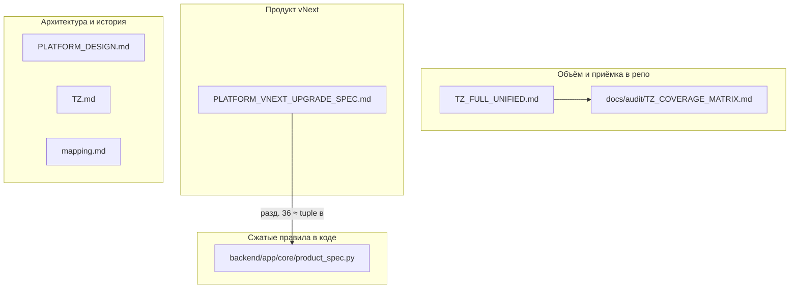

# Карта спецификаций (одним взглядом)

Кратко: **что читать и зачем**, без дублирования текста требований. Правило «по ТЗ» без ссылки — в [README](README.md) (секция в начале) и в корневом `AGENTS.md`.

## Файл → назначение

| Документ | Назначение |
|----------|------------|
| [TZ_FULL_UNIFIED.md](TZ_FULL_UNIFIED.md) | P0/P1, [MVP]-теги, B1–B5 / F1–F4, приёмка в репозитории |
| [PLATFORM_VNEXT_UPGRADE_SPEC.md](PLATFORM_VNEXT_UPGRADE_SPEC.md) | Продуманная эволюция продукта, издания, паритет; **разд. 36** — ограничения на доработки |
| [PLATFORM_DESIGN.md](PLATFORM_DESIGN.md) | Целевая архитектура платформы |
| [TZ.md](TZ.md) | Историческое / полное исходное ТЗ (справочно) |
| [mapping.md](mapping.md) | Соответствие требований и кода (если ведёте) |
| [../audit/TZ_COVERAGE_MATRIX.md](../audit/TZ_COVERAGE_MATRIX.md) | Статус покрытия требований (если ведёте) |

**Порядок по умолчанию для кода:** сначала `TZ_FULL_UNIFIED` → при рефакторинге/новых фичах учитывать разд. 36 vNext / `product_spec.py` — подробно в [README](README.md).
