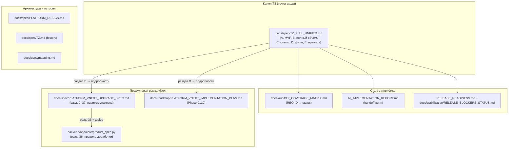

# Карта спецификаций (одним взглядом)

**Канон:** [`TZ_FULL_UNIFIED.md`](./TZ_FULL_UNIFIED.md) — точка входа для фразы «продолжай по ТЗ» (см. раздел 0 этого файла).

## Файл → назначение

| Документ | Назначение |
|----------|------------|
| [`TZ_FULL_UNIFIED.md`](./TZ_FULL_UNIFIED.md) | **Канон.** Точка входа «продолжай по ТЗ»: MVP-объём (`A`), полный объём (`B`), статус (`C`), фазы (`D`), правила доработки (`E`), карта канонических документов (`G`) |
| [`PLATFORM_VNEXT_UPGRADE_SPEC.md`](./PLATFORM_VNEXT_UPGRADE_SPEC.md) | Полный продуктовый upgrade-spec vNext (разд. 0–37). Подробности к разделу B канона. Разд. 36 — обязательные ограничения для доработки |
| [`PLATFORM_DESIGN.md`](./PLATFORM_DESIGN.md) | Целевая архитектура платформы (modular monolith, bounded contexts) |
| [`TZ.md`](./TZ.md) | Историческое исходное ТЗ (справочно, для приёмки не использовать) |
| [`mapping.md`](./mapping.md) | Соответствие разделов и кода |
| [`../audit/TZ_COVERAGE_MATRIX.md`](../audit/TZ_COVERAGE_MATRIX.md) | Статус покрытия MVP-требований (`done` / `partial` / `missing`) |
| [`../roadmap/PLATFORM_VNEXT_IMPLEMENTATION_PLAN.md`](../roadmap/PLATFORM_VNEXT_IMPLEMENTATION_PLAN.md) | Фазированный план реализации |
| [`../../AI_IMPLEMENTATION_REPORT.md`](../../AI_IMPLEMENTATION_REPORT.md) | Журнал волн / handoff / «Следующий точный шаг» |

**Порядок по умолчанию для агента:** `TZ_FULL_UNIFIED.md` → `AI_IMPLEMENTATION_REPORT.md` → `TZ_COVERAGE_MATRIX.md` → при необходимости подробностей конкретного блока — `PLATFORM_VNEXT_UPGRADE_SPEC.md`. Подробно — раздел `0` в `TZ_FULL_UNIFIED.md` и [`README.md`](./README.md) этого каталога.
