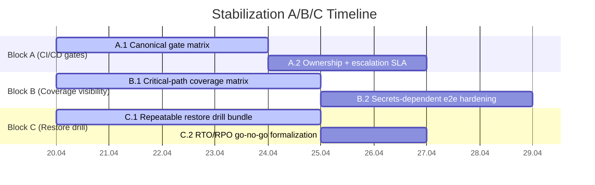
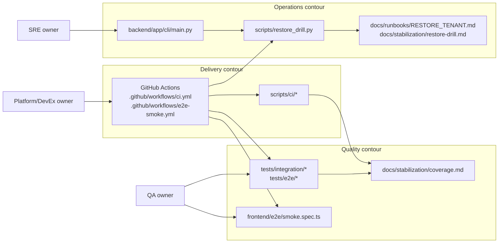

# Stabilization Plan Tracker (Canonical)

_Last updated: 2026-04-20._

This version restructures the active business request into **blocks A/B/C** and ties each task to verifiable evidence in code, workflows, scripts, and documentation.

## Status legend

- `todo` — scoped but not started.
- `in_progress` — implementation started and partially evidenced.
- `done` — acceptance criteria met with executable evidence.

## Block A — CI/CD stabilization gates

### A.1 Canonical security gate matrix
- **status:** `in_progress`
- **owner:** Platform / DevEx
- **code artifacts:** `.github/workflows/ci.yml`, `.github/workflows/e2e-smoke.yml`, `scripts/ci/static_gates.sh`, `scripts/ci/check_scoped_queries.py`, `scripts/ci/check_runtime_artifacts.py`, `scripts/ci/check_default_secrets.py`, `docs/stabilization/security-gates.md`
- **acceptance criteria:**
  1. `docs/stabilization/security-gates.md` maps each mandatory gate to an exact CI job and owning team.
  2. Every gate row includes a machine-verifiable evidence path (workflow job name + script/test path).
  3. Merge policy for failed gates is explicit (`blocking` vs `advisory`) and consistent with CI config.
- **evidence paths:**
  - workflows: `.github/workflows/ci.yml`, `.github/workflows/e2e-smoke.yml`
  - scripts: `scripts/ci/static_gates.sh`, `scripts/ci/check_scoped_queries.py`, `scripts/ci/check_runtime_artifacts.py`, `scripts/ci/check_default_secrets.py`
  - docs: `docs/stabilization/security-gates.md`
- **rollback note (high-risk):** if a new blocking gate causes false-positive merge freeze, temporarily downgrade the gate to advisory in workflow YAML and keep the check executable as non-blocking until the rule is corrected.

### A.2 Gate ownership and escalation SLA codification
- **status:** `todo`
- **owner:** Platform / Security
- **code artifacts:** `docs/stabilization/security-gates.md`, `.github/CODEOWNERS` (if updated)
- **acceptance criteria:**
  1. Each blocking gate has a primary owner and fallback owner.
  2. Escalation windows and incident handoff are documented and linked from the same table.
- **evidence paths:**
  - docs: `docs/stabilization/security-gates.md`
  - workflows: `.github/workflows/ci.yml`
- **rollback note (high-risk):** if ownership routing breaks approvals, revert CODEOWNERS-level change and retain owner mapping only in docs until routing is validated.

## Block B — Test coverage visibility (unit/integration/e2e)

### B.1 Critical-path coverage matrix normalization
- **status:** `in_progress`
- **owner:** QA / Backend / Frontend
- **code artifacts:** `docs/stabilization/coverage.md`, `tests/integration/*`, `tests/e2e/*`, `frontend/e2e/smoke.spec.ts`, `.github/workflows/ci.yml`
- **acceptance criteria:**
  1. `docs/stabilization/coverage.md` maps each critical business path to at least one automated test.
  2. Gaps are explicit (`missing`, `partial`, `flaky`, `secrets-dependent`) and linked to exact test/workflow paths.
  3. Coverage review cadence and owner are present in the document metadata.
- **evidence paths:**
  - tests: `tests/integration/test_tenant_isolation.py`, `tests/integration/test_cross_tenant_resource_matrix.py`, `tests/e2e/final_regression/test_final_regression_api.py`, `frontend/e2e/smoke.spec.ts`
  - workflows: `.github/workflows/ci.yml`, `.github/workflows/e2e-smoke.yml`
  - docs: `docs/stabilization/coverage.md`, `docs/TEST_BASELINE.md`
- **rollback note (high-risk):** if new required suites create unstable CI, move flaky suites to non-blocking lane with quarantine label and preserve deterministic smoke/contract gates as blocking.

### B.2 Secrets-dependent e2e signal hardening
- **status:** `todo`
- **owner:** QA Automation
- **code artifacts:** `.github/workflows/e2e-smoke.yml`, `frontend/e2e/smoke.spec.ts`, `docs/stabilization/e2e-access.md`
- **acceptance criteria:**
  1. Required credentials matrix is explicit (required vs optional) with skip policy.
  2. A failed secrets preflight is surfaced as actionable diagnostics, not silent reduction of test signal.
- **evidence paths:**
  - workflows: `.github/workflows/e2e-smoke.yml`
  - tests: `frontend/e2e/smoke.spec.ts`, `tests/e2e/access/test_access_enforcement_matrix.py`
  - docs: `docs/stabilization/e2e-access.md`

## Block C — Backup/restore operational drill

### C.1 Repeatable restore drill with evidence bundle
- **status:** `in_progress`
- **owner:** SRE / Platform
- **code artifacts:** `backend/app/cli/main.py`, `docs/runbooks/RESTORE_TENANT.md`, `docs/stabilization/restore-drill.md`, `scripts/restore_drill.py`, `tests/test_cli_commands.py`
- **acceptance criteria:**
  1. `docs/stabilization/restore-drill.md` defines a repeatable drill with pre-check, execution, post-check, and evidence bundle schema.
  2. Runbook commands are executable from repository scripts/CLI without manual undocumented steps.
  3. Validation includes tenant isolation and application health checks after restore.
- **evidence paths:**
  - scripts: `scripts/restore_drill.py`
  - cli/modules: `backend/app/cli/main.py`
  - tests: `tests/test_cli_commands.py`, `tests/test_health_ready.py`, `tests/integration/test_tenant_isolation.py`
  - docs: `docs/runbooks/RESTORE_TENANT.md`, `docs/stabilization/restore-drill.md`
- **rollback note (high-risk):** if restore flow corrupts tenant data or misses invariants, immediately stop automated apply phase, revert to last verified backup snapshot, and execute tenant-isolation + health validation before reopening traffic.

### C.2 Rollback window and go/no-go criteria formalization
- **status:** `todo`
- **owner:** SRE / Incident Commander
- **code artifacts:** `docs/stabilization/restore-drill.md`, `docs/runbooks/RESTORE_TENANT.md`
- **acceptance criteria:**
  1. Maximum tolerated restore window (RTO) and acceptable data loss window (RPO) are explicit.
  2. Go/no-go decision points are attached to measurable checks (health, tenancy, smoke).
- **evidence paths:**
  - docs: `docs/stabilization/restore-drill.md`, `docs/runbooks/RESTORE_TENANT.md`
  - tests/scripts: `scripts/restore_drill.py`, `tests/test_health_ready.py`

## Timeline (A/B/C)

## Architecture map (roles/contours bound to real modules)

## Cross-block evidence index (verifiable paths)

| Block | tests | workflows | scripts | docs |
|---|---|---|---|---|
| A | `tests/test_api_guardrails.py`, `tests/test_openapi_contract.py` | `.github/workflows/ci.yml`, `.github/workflows/e2e-smoke.yml` | `scripts/ci/static_gates.sh`, `scripts/ci/check_runtime_artifacts.py`, `scripts/ci/check_scoped_queries.py`, `scripts/ci/check_default_secrets.py` | `docs/stabilization/security-gates.md`, `docs/stabilization/README.md` |
| B | `tests/integration/test_tenant_isolation.py`, `tests/integration/test_cross_tenant_resource_matrix.py`, `tests/e2e/access/test_access_enforcement_matrix.py`, `frontend/e2e/smoke.spec.ts` | `.github/workflows/ci.yml`, `.github/workflows/e2e-smoke.yml` | `scripts/pytest.sh`, `scripts/smoke.sh` | `docs/stabilization/coverage.md`, `docs/stabilization/e2e-access.md`, `docs/TEST_BASELINE.md` |
| C | `tests/test_cli_commands.py`, `tests/test_health_ready.py`, `tests/integration/test_tenant_isolation.py` | `.github/workflows/ci.yml` | `scripts/restore_drill.py` | `docs/stabilization/restore-drill.md`, `docs/runbooks/RESTORE_TENANT.md`, `docs/stabilization/RUNBOOK_STABILIZATION.md` |

## Change-control rule for this tracker

Any PR that changes status in A/B/C must also update:
1. this `PLAN.md` block item status,
2. one corresponding domain document (`security-gates.md`, `coverage.md`, or `restore-drill.md`),
3. and at least one executable evidence path (test/workflow/script).
